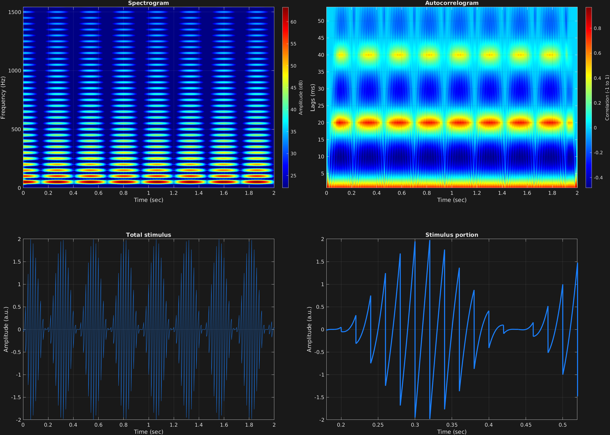

Another attribute-value option is amplitude modulation, with the attribute `'am'`. In general the amplitude modulation implemented here is typical, corresponding to the equation:

$$x(t)=\big(A+a_m\sin(2\pi f_m t)\big)a_c\sin(2\pi f_c t)$$

This attribute requires 4 subsequent values:
- Modulator waveform(s). Cell array of char array(s), like carrier waveform. Can be `'sin'`, `'cos'`, `'squ'`, or `'saw'`, corresponding to sine, cosine, square, or sawtooth.
- Modulator frequency(s). Corresponds to $f_m$ above; Scalar, vector, matrix, or cell array, with first dimension time spans, and second dimension frequency components. Can be automated.
- Modulator amplitude(s) or "depth(s)". Corresponds to $a_m$ above; Scalar, vector, matrix, or cell array, with first dimension time spans, and second dimension frequency components. Can be automated.
- Carrier frequency amplitude. Corresponds to $A$ above, controlling amount of carrier frequency amplitude in resulting spectrum. Scalar, vector, or matrix, with first dimension time spans, and second dimension frequency components.

In this example, a sawtooth carrier is slowly modulated by a sinusoidal amplitude modulator. 

```matlab
% Some plotting parameters
colorRatio=.67;
NFFT=8192*4;
specFreqPerc=[0 7];
specWindowLength=5000;
autoFreqPerc=[1 70];
xTimes=[.18 .52];

% Stimulus parameters
tSpans=[0 2];
fs=44100;
carWaves={'saw'};
carFreqs=50;
carAmps=1;
carThs=0;
rampTime=.06;
rampExp=1;
amFreq=4;
amAmp=1;
amCfreq=1;

% Create stimulus structure
s = stimulusMake(1, 'fcn', tSpans, fs, carWaves, carFreqs, carAmps, carThs, ...
    'ramp', rampTime, rampExp, 'am', {'sin'}, amFreq, amAmp, amCfreq);

% Do some visualization
figure(1)
set(gcf,'position',[50 50 1700 1350])

subplot(2,2,1)
[~,~,cbar]=mdlSpec(s.x,NFFT,s.fs,specFreqPerc,specWindowLength);
grid on
temp=get(cbar,'limits');
colormap('jet')
totalRange=diff(temp);
cutoff=(colorRatio*totalRange)+temp(1);
caxis([cutoff temp(2)])

subplot(2,2,2)
mdlAutocorr(s.x,s.fs,autoFreqPerc);
grid on

subplot(2,2,3)
plot(s.t,s.x)
title('Total stimulus')
xlabel('Time (sec)')
ylabel('Amplitude (a.u.)')
grid on
zoom xon

subplot(2,2,4)
plot(s.t,s.x,'linewidth',2)
title('Stimulus portion')
xlabel('Time (sec)')
ylabel('Amplitude (a.u.)')
xlim(xTimes)
grid on
zoom xon
```




