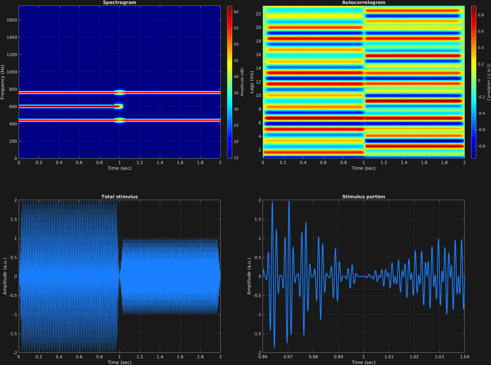

In this amplitude modulation example, there are two time spans. We recall the amplitude modulation equation:

$$x(t)=\big(A+a_m\sin(2\pi f_m t)\big)a_c\sin(2\pi f_c t)$$

And in this case, time span one has $A=1$, and time span two has $A=0$. We note the presence of the carrier frequency $f_c=600$ in the spectrum of the first time span, but not the second.

```matlab
% Some plotting parameters
colorRatio=.67;
NFFT=8192*4;
specFreqPerc=[0 8];
specWindowLength=5000;
autoFreqPerc=[1 30];
xTimes=[.96 1.04];

% Stimulus parameters
tSpans=[0 1;
        1 2];
fs=44100;
carWaves={'sin'};
carFreqs=600;
carAmps=1;
carThs=0;
rampTime=.03;
rampExp=1;
amFreq=160;
amAmp=1;
amCfreq=[1;
         0];

% Create stimulus structure
s = stimulusMake(1, 'fcn', tSpans, fs, carWaves, carFreqs, carAmps, carThs, ...
    'ramp', rampTime, rampExp, 'am', {'sin'}, amFreq, amAmp, amCfreq);

% Do some visualization
figure(1)
set(gcf,'position',[50 50 1700 1350])

subplot(2,2,1)
[~,~,cbar]=mdlSpec(s.x,NFFT,s.fs,specFreqPerc,specWindowLength);
grid on
temp=get(cbar,'limits');
colormap('jet')
totalRange=diff(temp);
cutoff=(colorRatio*totalRange)+temp(1);
caxis([cutoff temp(2)])

subplot(2,2,2)
mdlAutocorr(s.x,s.fs,autoFreqPerc);
grid on

subplot(2,2,3)
plot(s.t,s.x)
title('Total stimulus')
xlabel('Time (sec)')
ylabel('Amplitude (a.u.)')
grid on
zoom xon

subplot(2,2,4)
plot(s.t,s.x,'linewidth',2)
title('Stimulus portion')
xlabel('Time (sec)')
ylabel('Amplitude (a.u.)')
xlim(xTimes)
grid on
zoom xon
```




[<center>Back to stimulus home</center>](stimuli.html)