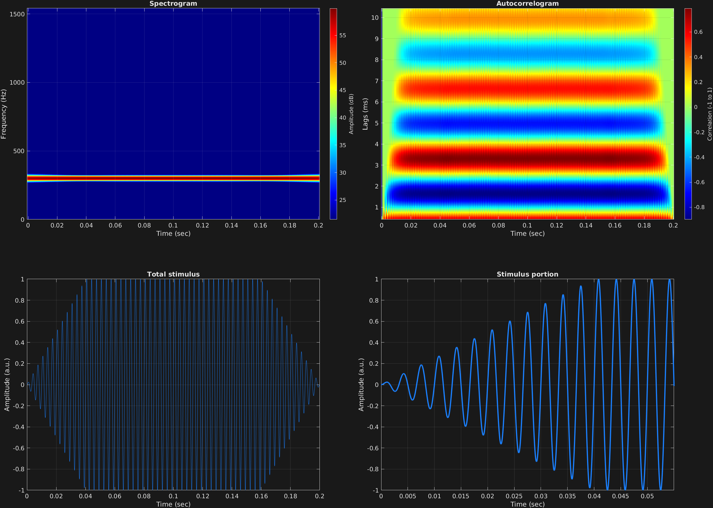

A common feature of many types of auditory stimuli is a ramp up at the beginning and ramp down at the end, partially to avoid potential non-zero values at the edges which would result in clicks or pops from the transducer. Such ramping is implemented here, with an ability to specify the duration of ramping (both up and down), and the quickness of ramping, simply defined as a diversion from linear amplitude change with an exponent.

Many function calls in the [GrFNN Toolbox](https://github.com/musicdynamicslab/grfnntoolbox) utilize a general [attribute-value](https://en.wikipedia.org/wiki/Name%E2%80%93value_pair) structure, in which an attribute is invoked with a character array, and its value(s) come as necessary subsequent input arguments. `stimulusMake()` works in this way, with inputs after the carrier specifications coming in attribute-value orders. The attributes that are specified with an initial char array can come in any order, but each of them must be followed with the necessary values. All this is specified in the `help` of `stimulusMake()`. The attribute `'ramp'` takes two values, each a scalar: the duration of the ramps (up and down) in seconds, and the quickness of the ramps as an exponent, with exponent greater than 1 corresponding to quicker than linear, and exponent between 0 and 1 corresponding to more gradual.

The following example shows a simple linear ramp of a single time span. 

```matlab
% Some plotting parameters
colorRatio=.67;
NFFT=8192*4;
specFreqPerc=[0 7];
specWindowLength=4000;
autoFreqPerc=[3 70];
xTimes=[0 .055];

% Stimulus parameters
tSpans=[0 .2];
fs=44100;
carWaves={'sin'};
carFreqs=300;
carAmps=1;
carThs=0;
rampTime=.04;
rampExp=1;

% Create stimulus structure
s = stimulusMake(1, 'fcn', tSpans, fs, carWaves, carFreqs, carAmps, carThs, ...
    'ramp', rampTime, rampExp);

% Do some visualization
figure(1)
set(gcf,'position',[50 50 1700 1350])

subplot(2,2,1)
[~,~,cbar]=mdlSpec(s.x,NFFT,s.fs,specFreqPerc,specWindowLength);
grid on
temp=get(cbar,'limits');
colormap('jet')
totalRange=diff(temp);
cutoff=(colorRatio*totalRange)+temp(1);
caxis([cutoff temp(2)])

subplot(2,2,2)
mdlAutocorr(s.x,s.fs,autoFreqPerc);
grid on

subplot(2,2,3)
plot(s.t,s.x)
title('Total stimulus')
xlabel('Time (sec)')
ylabel('Amplitude (a.u.)')
grid on
zoom xon

subplot(2,2,4)
plot(s.t,s.x,'linewidth',2)
title('Stimulus portion')
xlabel('Time (sec)')
ylabel('Amplitude (a.u.)')
xlim(xTimes)
grid on
zoom xon
```




[<center>Back to stimulus home</center>](stimuli.html)