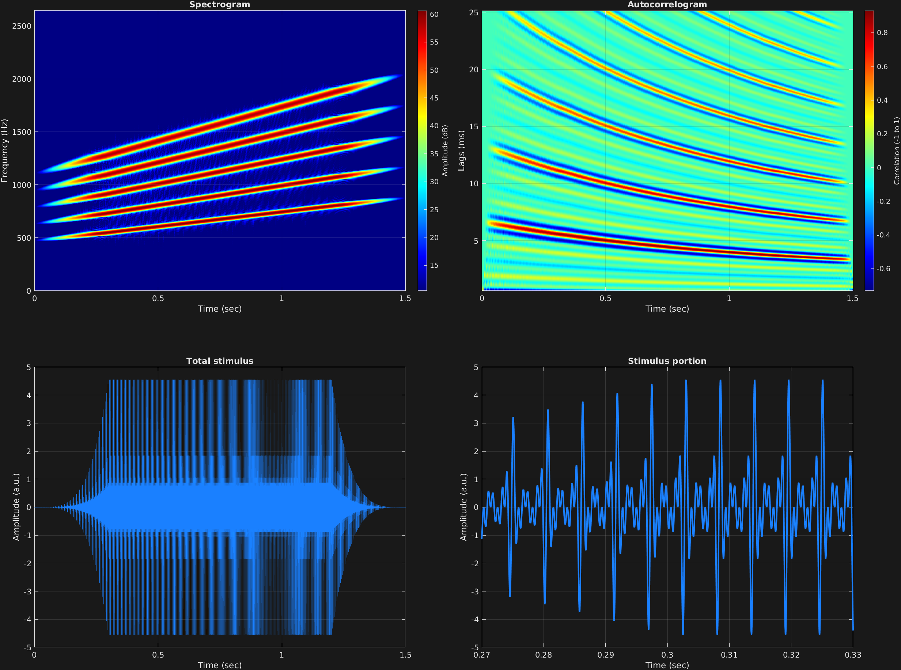

This example shows a nonlinear ramp applied to several stimulus frequency components in the same time span. This is a good example of stimulus parameters (in this case, stimulus ramping parameters, and also carrier amplitude) being copied to all frequency components when multiple values are not specified. Additionally, each frequency component is automated. Specifically, we have harmonics 3 through 7 of missing fundamental frequency 150 Hz, moving steadily up to the same harmonics of missing fundamental frequency of 300 Hz, all over the course of a time span of 1.5 seconds. 

```matlab
% Some plotting parameters
colorRatio=.67;
NFFT=8192*4;
specFreqPerc=[0 12];
specWindowLength=5000;
autoFreqPerc=[1 40];
xTimes=[.27 .33];

% Stimulus parameters
tSpans=[0 1.5];
fs=44100;
carWaves={'sin'};
carFreqs={[150 300]*3 [150 300]*4 [150 300]*5 [150 300]*6 [150 300]*7};
carAmps=1;
carThs=0;
rampTime=.3;
rampExp=4;

% Create stimulus structure
s = stimulusMake(1, 'fcn', tSpans, fs, carWaves, carFreqs, carAmps, carThs, ...
    'ramp', rampTime, rampExp);

% Do some visualization
figure(1)
set(gcf,'position',[50 50 1700 1350])

subplot(2,2,1)
[~,~,cbar]=mdlSpec(s.x,NFFT,s.fs,specFreqPerc,specWindowLength);
grid on
temp=get(cbar,'limits');
colormap('jet')
totalRange=diff(temp);
cutoff=(colorRatio*totalRange)+temp(1);
caxis([cutoff temp(2)])

subplot(2,2,2)
mdlAutocorr(s.x,s.fs,autoFreqPerc);
grid on

subplot(2,2,3)
plot(s.t,s.x)
title('Total stimulus')
xlabel('Time (sec)')
ylabel('Amplitude (a.u.)')
grid on
zoom xon

subplot(2,2,4)
plot(s.t,s.x,'linewidth',2)
title('Stimulus portion')
xlabel('Time (sec)')
ylabel('Amplitude (a.u.)')
xlim(xTimes)
grid on
zoom xon
```




