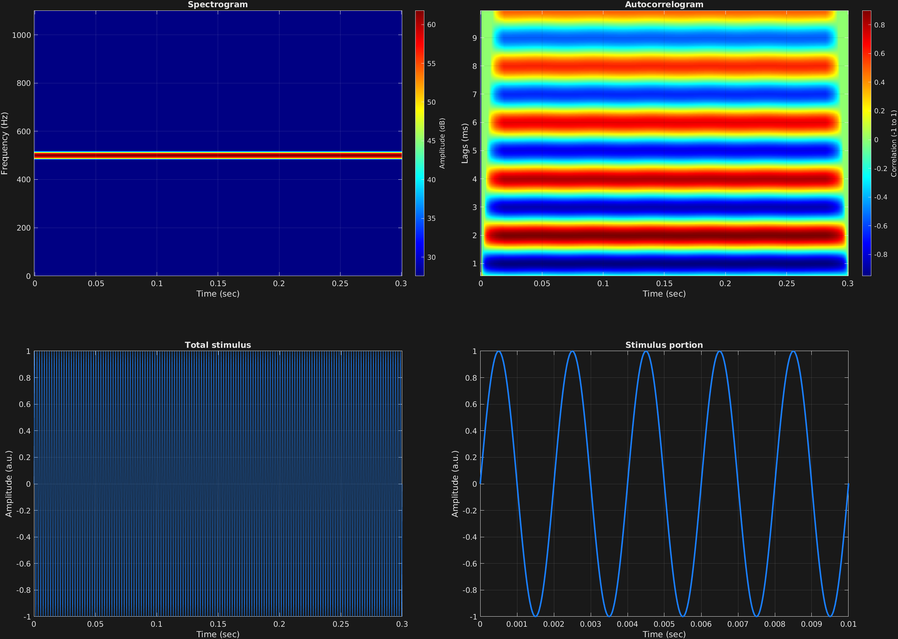

This is the first example.

```matlab
% Some plotting parameters
colorRatio=.67;
NFFT=8192*4;
specFreqPerc=[0 5];
specWindowLength=5000;
autoFreqPerc=[3 50];
xTimes=[0 0.01];

% Stimulus parameters
tSpans=[0 0.3];
fs=44100;
carWaves={'sin'};
carFreqs=500;
carAmps=1;

% Create stimulus structure
s = stimulusMake(1, 'fcn', tSpans, fs, carWaves, carFreqs, carAmps);

% Do some visualization
figure
set(gcf,'position',[50 50 1700 1350])

subplot(2,2,1)
[~,~,cbar]=mdlSpec(s.x,NFFT,s.fs,specFreqPerc,specWindowLength);
grid on
temp=get(cbar,'limits');
colormap('jet')
totalRange=diff(temp);
cutoff=(colorRatio*totalRange)+temp(1);
caxis([cutoff temp(2)])

subplot(2,2,2)
mdlAutocorr(s.x,s.fs,autoFreqPerc);
grid on

subplot(2,2,3)
plot(s.t,s.x)
title('Total stimulus')
xlabel('Time (sec)')
ylabel('Amplitude (a.u.)')
grid on
zoom xon

subplot(2,2,4)
plot(s.t,s.x,'linewidth',2)
title('Stimulus portion')
xlabel('Time (sec)')
ylabel('Amplitude (a.u.)')
xlim(xTimes)
grid on
zoom xon
```




