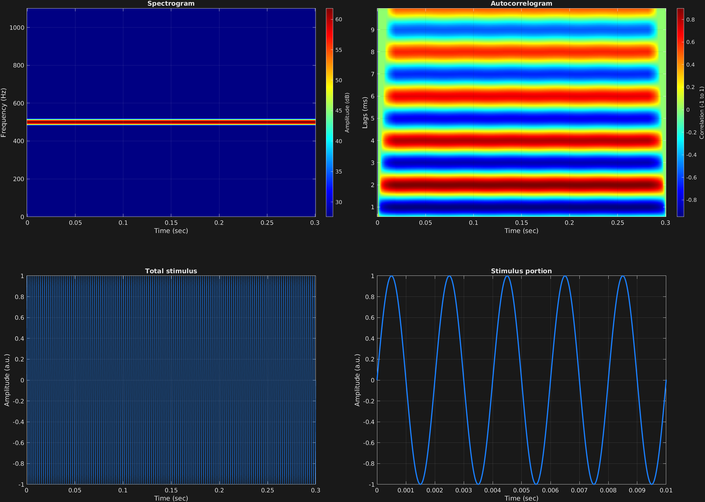

The main user-facing function from the [GrFNN Toolbox](https://github.com/musicdynamicslab/grfnntoolbox) that makes a stimulus is `stimulusMake()`. A simple, typical call looks like this:
```matlab
s = stimulusMake(1, 'fcn', tSpans, fs, carWaves, carFreqs, carAmps);
```

The output `s` (or whatever you choose to name it) is a MATLAB struct that contains useful fields such as:
- `s.t`: A time vector for the stimulus you created
- `s.x`: The actual stimulus vector you created

The first two inputs are necessary for integration in the toolbox, and will always remain the same for the present purposes. The next five inputs are always necessary and come in this order:
- Time vector(s). 1x2 vector indicating start and end times in units of seconds. Nx2 matrix to specify N time spans. For example, `[0 1]` for a stimulus of 1 second, or `[0 1;1 2]` for a stimulus with two time spans, one after another, each one second long.
- Sampling frequency. A scalar in units of Hertz.
- Carrier waveform(s). This is always a columnar cell array with N character arrays. Possible carrier waveforms are `'cos'`, `'sin'`, `'exp'`, `'saw'`, `'squ'`, and `'noi'`, corresponding to cosine, sine, complex exponential, sawtooth, square, and white noise, respectively. `'exp'` gives a complex-valued sinusoid, while all others are real-valued. So this input might be `{'sin'}` for a sine wave, or e.g. `{'sin';'noi'}` for two time spans, the first with a sine wave, and the second with white noise.
- Carrier frequency(s). Scalar, vector, or matrix of carrier wave frequencies, in Hertz. First dimension corresponds to time spans, so `[100;200]` would mean the first time span has 100 Hz, and the second has 200 Hz. Second dimension corresponds to multiple components within the time span, so `[100 200]` would mean a single time span, with both 100 and 200 Hz carrier waves. `[100 200;200 400]` would give one time span consisting of 100 and 200 Hz, and a second with 200 and 400 Hz.
- Carrier amplitudes. Scalar, vector, or matrix with the same structure as the carrier frequencies. 

Here is a complete example of creation and visualization of a single sinusoidal stimulus. The visualization utilities `mdlSpec()` and `mdlAutocorr()` are also part of the [GrFNN Toolbox](https://github.com/musicdynamicslab/grfnntoolbox). They plot a spectrogram and autocorrelogram respectively. An audio player to hear the stimulus is below the image.

```matlab
% Some plotting parameters
colorRatio=.67;
NFFT=8192*4;
specFreqPerc=[0 5];
specWindowLength=5000;
autoFreqPerc=[3 50];
xTimes=[0 0.01];

% Stimulus parameters
tSpans=[0 0.3];
fs=44100;
carWaves={'sin'};
carFreqs=500;
carAmps=1;

% Create stimulus structure
s = stimulusMake(1, 'fcn', tSpans, fs, carWaves, carFreqs, carAmps);

% Do some visualization
figure
set(gcf,'position',[50 50 1700 1350])

subplot(2,2,1)
[~,~,cbar]=mdlSpec(s.x,NFFT,s.fs,specFreqPerc,specWindowLength);
grid on
temp=get(cbar,'limits');
colormap('jet')
totalRange=diff(temp);
cutoff=(colorRatio*totalRange)+temp(1);
caxis([cutoff temp(2)])

subplot(2,2,2)
mdlAutocorr(s.x,s.fs,autoFreqPerc);
grid on

subplot(2,2,3)
plot(s.t,s.x)
title('Total stimulus')
xlabel('Time (sec)')
ylabel('Amplitude (a.u.)')
grid on
zoom xon

subplot(2,2,4)
plot(s.t,s.x,'linewidth',2)
title('Stimulus portion')
xlabel('Time (sec)')
ylabel('Amplitude (a.u.)')
xlim(xTimes)
grid on
zoom xon
```




