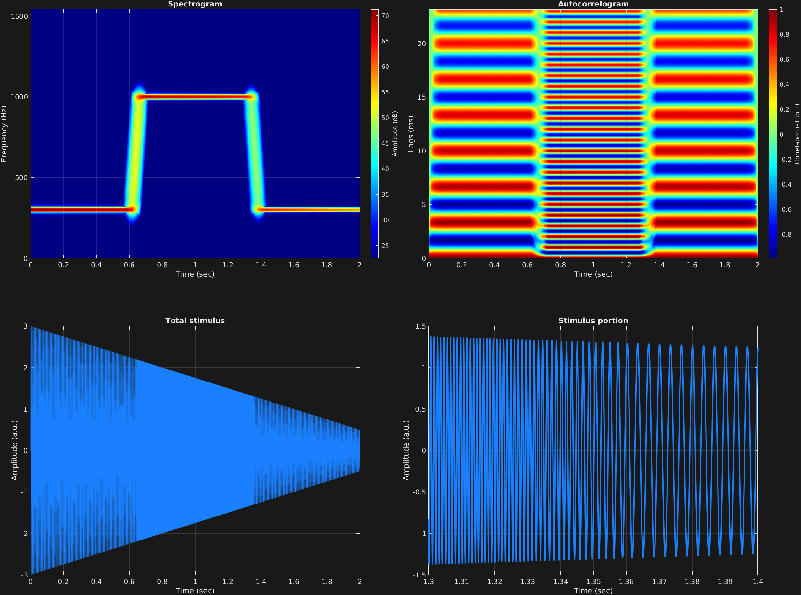

In this example it is shown that one can "automate" frequency and amplitude (of the carrier, as well as the modulators, as is shown in a different example). By automate, we mean that there can be multiple values for a given frequency component, of frequency and/or amplitude, rather than just one. If there is more than one value given, then the values that are given are linearly interpolated to the length of the frequency component. So if the frequency is given as `{[100 200]}`, it will simply start at 100 Hz and end at 200 Hz, moving continuously up over then length of the entire time span. If something more complicated is given, such as `{[linspace(100,100,100) linspace(100,200,100) linspace(200,200,100)]}`, then this frequency component would stay at 100 Hz for the first roughly third of the time span, then linearly move from 100 to 200 Hz over the next third, then stay at 200 Hz for the remaining third.

To input automated values, the input variable needs to be a cell array rather than a matrix. The cell array then has the same structure as the matrix would, with the first dimension corresponding to time spans, and the second dimension to frequency components. Each value in the cell array is a vector of values to interpolate. In the below example, both carrier frequency and amplitude are automated. The frequency starts at 300 Hz for roughly the first third, then moves pretty quickly from there to 1,000 Hz for another third, and comes back down to 300 Hz for the remaining third. The carrier amplitude simply starts at 3 and moves steadily down to 0.5 over the course of the entire time span. 

```matlab
% Some plotting parameters
colorRatio=.67;
NFFT=8192*4;
specFreqPerc=[0 7];
specWindowLength=5000;
autoFreqPerc=[0 30];
xTimes=[1.3 1.4];

% Stimulus parameters
tSpans=[0 2];
fs=44100;
carWaves={'sin'};
carFreqs={[ones(1,1000)*300 linspace(300,1000,70) ones(1,1000)*1000 linspace(1000,300,70) ones(1,1000)*300]};
carAmps={[3 .5]};
carThs=0;

% Create stimulus structure
s = stimulusMake(1, 'fcn', tSpans, fs, carWaves, carFreqs, carAmps, carThs);

% Do some visualization
figure(1)
set(gcf,'position',[50 50 1700 1350])

subplot(2,2,1)
[~,~,cbar]=mdlSpec(s.x,NFFT,s.fs,specFreqPerc,specWindowLength);
grid on
temp=get(cbar,'limits');
colormap('jet')
totalRange=diff(temp);
cutoff=(colorRatio*totalRange)+temp(1);
caxis([cutoff temp(2)])

subplot(2,2,2)
mdlAutocorr(s.x,s.fs,autoFreqPerc);
grid on

subplot(2,2,3)
plot(s.t,s.x)
title('Total stimulus')
xlabel('Time (sec)')
ylabel('Amplitude (a.u.)')
grid on
zoom xon

subplot(2,2,4)
plot(s.t,s.x,'linewidth',2)
title('Stimulus portion')
xlabel('Time (sec)')
ylabel('Amplitude (a.u.)')
xlim(xTimes)
grid on
zoom xon
```




