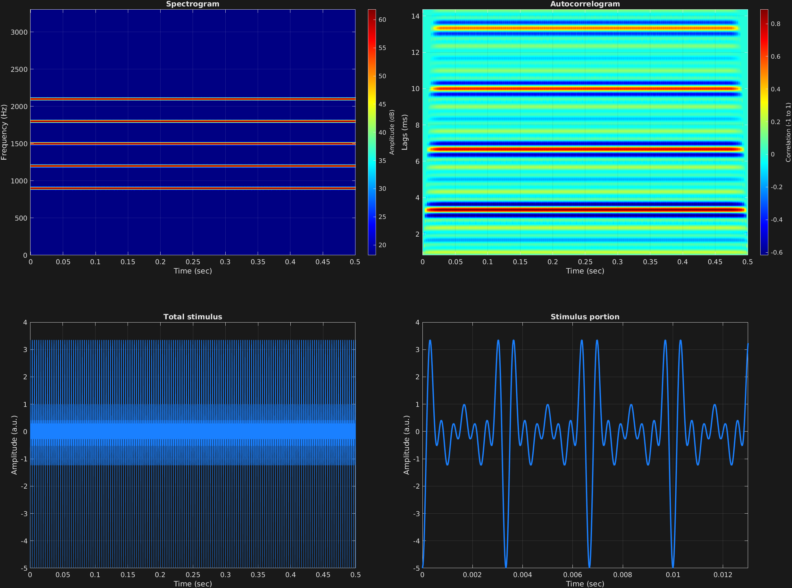

The next input after carrier amplitudes is optional: A scalar, vector, or matrix of starting phases with the same structure as the carrier frequencies. If left out, all starting phases default to zero.

The below example shows several carrier frequency components in a single time span, all with a starting phase of $\frac{3\pi}{2}$, corresponding to $-\cos(2\pi ft)$, thus all starting at the lowest point of a trough. We can see here that when multiple carrier frequencies are specified but only a single carrier amplitude and starting phase, that the amplitudes and starting phases are simply copied to all frequencies.

```matlab
% Some plotting parameters
colorRatio=.67;
NFFT=8192*4;
specFreqPerc=[0 15];
specWindowLength=5000;
autoFreqPerc=[3 50];
xTimes=[0 0.013];

% Stimulus parameters
tSpans=[0 0.5];
fs=44100;
carWaves={'sin'};
carFreqs=300*[3 4 5 6 7];
carAmps=1;
carThs=3*pi/2;

% Create stimulus structure
s = stimulusMake(1, 'fcn', tSpans, fs, carWaves, carFreqs, carAmps, carThs);

% Do some visualization
figure(1)
set(gcf,'position',[50 50 1700 1350])

subplot(2,2,1)
[~,~,cbar]=mdlSpec(s.x,NFFT,s.fs,specFreqPerc,specWindowLength);
grid on
temp=get(cbar,'limits');
colormap('jet')
totalRange=diff(temp);
cutoff=(colorRatio*totalRange)+temp(1);
caxis([cutoff temp(2)])

subplot(2,2,2)
mdlAutocorr(s.x,s.fs,autoFreqPerc);
grid on

subplot(2,2,3)
plot(s.t,s.x)
title('Total stimulus')
xlabel('Time (sec)')
ylabel('Amplitude (a.u.)')
grid on
zoom xon

subplot(2,2,4)
plot(s.t,s.x,'linewidth',2)
title('Stimulus portion')
xlabel('Time (sec)')
ylabel('Amplitude (a.u.)')
xlim(xTimes)
grid on
zoom xon
```




