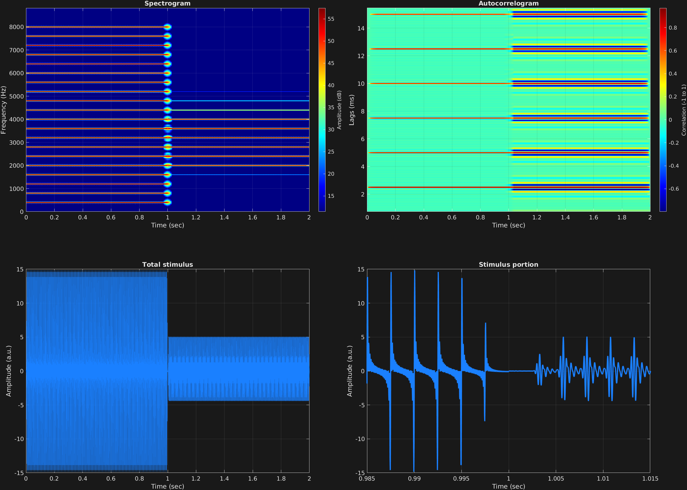

In addition to the ability to filter masking noise, we can also filter the stimulus signal itself in exactly the same way. The attribute for this option is `'filtstim'`, which also takes an Nx2 cell array of filter coefficients as `'filtmask'` does.

In this example, we have a large harmonic stack with fundamental frequency 400 Hz again, in two time spans. In the first time span, we enter empty vectors for filter coefficients, which will result in the behavior of not filtering. For the second time span, we enter filter coefficients for a steep bandpass between 2,000 and 4,000 Hz. We can observe the filter's frequency response in the resulting spectrogram.

```matlab
% Some plotting parameters
colorRatio=.67;
NFFT=8192*4;
specFreqPerc=[0 40];
specWindowLength=3000;
autoFreqPerc=[1 20];
xTimes=[.985 1.015];

% Stimulus parameters
tSpans=[0 1;
        1 2];
fs=44100;
carWaves={'sin'};
carFreqs=400*(1:20);
carAmps=1;
carThs=0;
rampTime=.005;
rampExp=1;
[b,a]=butter(7,[2000 4000]/(fs/2));
filtStimParams={[] [];
                 b a};

% Create stimulus structure
s = stimulusMake(1, 'fcn', tSpans, fs, {'sin'}, carFreqs, carAmps, 'ramp', rampTime, rampExp, ...
    'filtstim', filtStimParams);


% Do some visualization
figure(1)
set(gcf,'position',[50 50 1700 1350])

subplot(2,2,1)
[~,~,cbar]=mdlSpec(s.x,NFFT,s.fs,specFreqPerc,specWindowLength);
grid on
temp=get(cbar,'limits');
colormap('jet')
totalRange=diff(temp);
cutoff=(colorRatio*totalRange)+temp(1);
caxis([cutoff temp(2)])

subplot(2,2,2)
mdlAutocorr(s.x,s.fs,autoFreqPerc);
grid on

subplot(2,2,3)
plot(s.t,s.x)
title('Total stimulus')
xlabel('Time (sec)')
ylabel('Amplitude (a.u.)')
grid on
zoom xon

subplot(2,2,4)
plot(s.t,s.x,'linewidth',2)
title('Stimulus portion')
xlabel('Time (sec)')
ylabel('Amplitude (a.u.)')
xlim(xTimes)
grid on
zoom xon
```




[<center>Back to stimulus home</center>](stimuli.html)