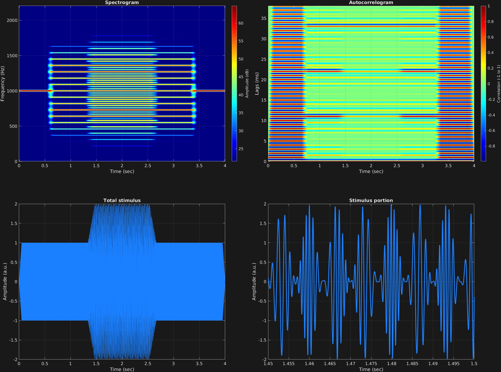

This example has just a single time span with a single carrier wave, and automated frequency and amplitude modulation. Frequency modulation is initiated instantaneously, whereas amplitude modulation is initiated with a ramp, utilizing the MATLAB function `linspace()`. Contributions to the signal spectrum are evident from both the frequency and amplitude modulation.

```matlab
% Some plotting parameters
colorRatio=.67;
NFFT=8192*4;
specFreqPerc=[0 10];
specWindowLength=7000;
autoFreqPerc=[0 30];
xTimes=[1.45 1.5];

% Stimulus parameters
tSpans=[0 4];
fs=44100;
carWaves={'sin'};
carFreqs=1000;
carAmps=1;
carThs=0;
rampTime=.05;
rampExp=1;
fmFreq=90;
fmAmp={[zeros(1,500) ones(1,2000)*.4 zeros(1,500)]};
amFreq=150;
amAmp={[zeros(1,1000) linspace(0,1,100) ones(1,800) linspace(1,0,100) zeros(1,1000)]};
amCfreq=1;

% Create stimulus structure
s = stimulusMake(1, 'fcn', tSpans, fs, carWaves, carFreqs, carAmps, ...
    'ramp', rampTime, rampExp, 'fm', {'sin'}, fmFreq, fmAmp, ...
    'am', {'cos'}, amFreq, amAmp, amCfreq);

% Do some visualization
figure(1)
set(gcf,'position',[50 50 1700 1350])

subplot(2,2,1)
[~,~,cbar]=mdlSpec(s.x,NFFT,s.fs,specFreqPerc,specWindowLength);
grid on
temp=get(cbar,'limits');
colormap('jet')
totalRange=diff(temp);
cutoff=(colorRatio*totalRange)+temp(1);
caxis([cutoff temp(2)])

subplot(2,2,2)
mdlAutocorr(s.x,s.fs,autoFreqPerc);
grid on

subplot(2,2,3)
plot(s.t,s.x)
title('Total stimulus')
xlabel('Time (sec)')
ylabel('Amplitude (a.u.)')
grid on
zoom xon

subplot(2,2,4)
plot(s.t,s.x,'linewidth',2)
title('Stimulus portion')
xlabel('Time (sec)')
ylabel('Amplitude (a.u.)')
xlim(xTimes)
grid on
zoom xon
```




[<center>Back to stimulus home</center>](stimuli.html)