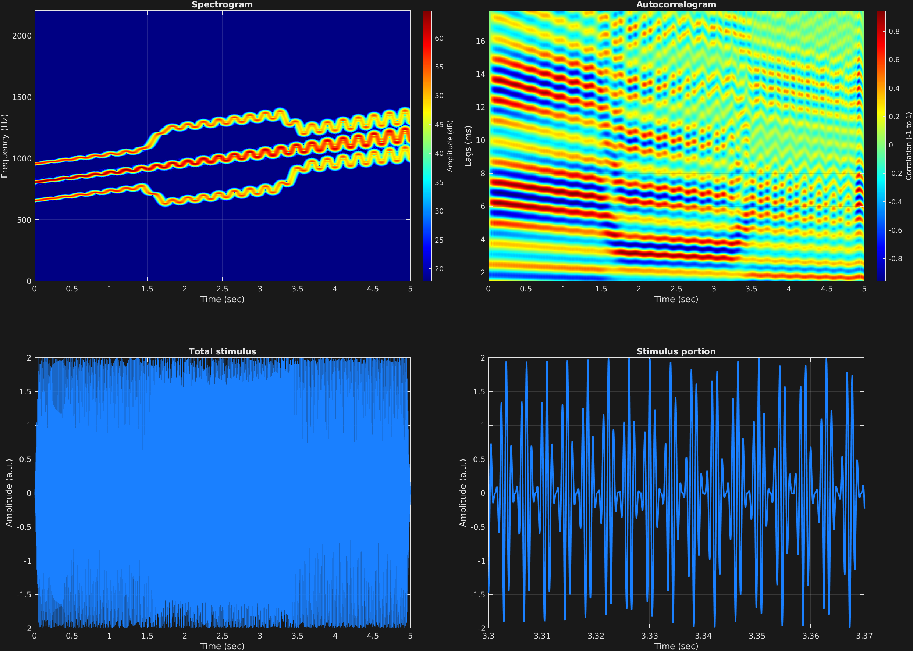

This example automates carrier frequency, amplitude modulation frequency, and frequency modulation amplitude. Firstly, the carrier frequency is slowly moving upward throughout. Secondly, the carrier is amplitude modulated throughout with a fast frequency, giving upper and lower sidebands which shift in the middle portion because of a change in amplitude modulation frequency. Thirdly, the carrier is frequency modulated with a slow frequency which is increasing in its depth throughout. The result of the latter is that all frequencies in the signal spectrum are frequency-modulated together.

```matlab
% Some plotting parameters
colorRatio=.67;
NFFT=8192*4;
specFreqPerc=[0 10];
specWindowLength=7000;
autoFreqPerc=[1 12];
xTimes=[3.3 3.37];

% Stimulus parameters
tSpans=[0 5];
fs=44100;
carWaves={'sin'};
carFreqs={[800 1200]};
carAmps=1;
carThs=0;
rampTime=.05;
rampExp=1;
fmFreq=5;
fmAmp={[0 .05]};
amFreq={[ones(1,500)*150 linspace(150,300,100) ones(1,500)*300 linspace(300,150,100) ones(1,500)*150]};
amAmp=1;
amCfreq=1;

% Create stimulus structure
s = stimulusMake(1, 'fcn', tSpans, fs, {'sin'}, carFreqs, carAmps, 'ramp', rampTime, rampExp, ...
    'fm', {'sin'}, fmFreq, fmAmp, 'am', {'sin'}, amFreq, amAmp, amCfreq);


% Do some visualization
figure(1)
set(gcf,'position',[50 50 1700 1350])

subplot(2,2,1)
[~,~,cbar]=mdlSpec(s.x,NFFT,s.fs,specFreqPerc,specWindowLength);
grid on
temp=get(cbar,'limits');
colormap('jet')
totalRange=diff(temp);
cutoff=(colorRatio*totalRange)+temp(1);
caxis([cutoff temp(2)])

subplot(2,2,2)
mdlAutocorr(s.x,s.fs,autoFreqPerc);
grid on

subplot(2,2,3)
plot(s.t,s.x)
title('Total stimulus')
xlabel('Time (sec)')
ylabel('Amplitude (a.u.)')
grid on
zoom xon

subplot(2,2,4)
plot(s.t,s.x,'linewidth',2)
title('Stimulus portion')
xlabel('Time (sec)')
ylabel('Amplitude (a.u.)')
xlim(xTimes)
grid on
zoom xon
```




