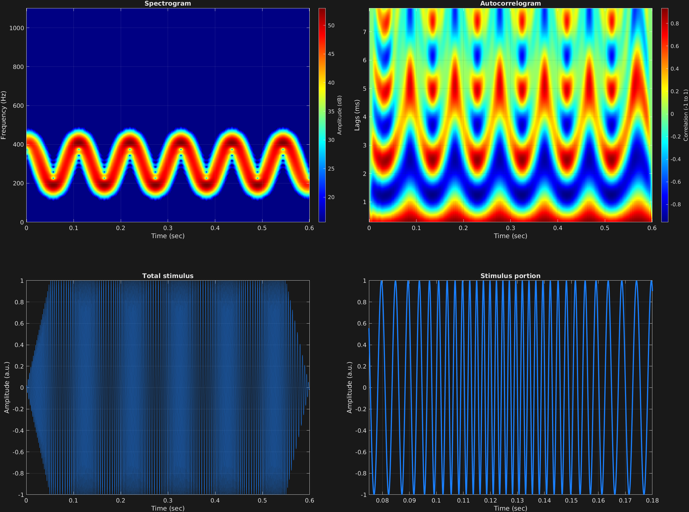

Another useful attribute with multiple required values is frequency modulation. The attribute character string for this is `'fm'`. The frequency modulation equation that is implemented is:

$$x(t)=a_c\sin \big(2\pi f_c t+a_m\sin(2\pi f_m t)+\theta_c\big)$$

The attribute `'fm'` takes three values:
- Modulator waveform. Cell array of character strings specifying waveform. Can be `'sin'`, `'cos'`, `'saw'`, or `'squ'`, corresponding to sine, cosine, sawtooth, or square wave modulation. Cell array can be a single value, vector, or matrix, corresponding to time spans and/or carrier frequency components.
- Modulator frequency, corresponding to $f_m$ in the above equation. Scalar, vector, or matrix.
- Modulator amplitude, or "depth", corresponding to $a_m$ above, where 0 corresponds to no modulation, and 1 corresponds to a depth, or [frequency deviation](https://en.wikipedia.org/wiki/Frequency_deviation), equal to the carrier frequency $f_c$. Scalar, vector, or matrix.

In this example, a simple sinusoid is sinusoidally amplitude modulated relatively slowly, to be able to visualize the frequency and depth of modulation. $\theta_c$ corresponds to initial phases of $f_c$ in units of radians, if specified. Scalar, vector, or matrix.

```matlab
% Some plotting parameters
colorRatio=.67;
NFFT=8192*4;
specFreqPerc=[0 5];
specWindowLength=2000;
autoFreqPerc=[1 24];
xTimes=[.075 .18];

% Stimulus parameters
tSpans=[0 .6];
fs=44100;
carWaves={'sin'};
carFreqs=300;
carAmps=1;
carThs=0;
rampTime=.05;
rampExp=1;
fmFreq=10;
fmAmp=.4;

% Create stimulus structure
s = stimulusMake(1, 'fcn', tSpans, fs, carWaves, carFreqs, carAmps, carThs, ...
    'ramp', rampTime, rampExp, 'fm', {'sin'}, fmFreq, fmAmp);

% Do some visualization
figure(1)
set(gcf,'position',[50 50 1700 1350])

subplot(2,2,1)
[~,~,cbar]=mdlSpec(s.x,NFFT,s.fs,specFreqPerc,specWindowLength);
grid on
temp=get(cbar,'limits');
colormap('jet')
totalRange=diff(temp);
cutoff=(colorRatio*totalRange)+temp(1);
caxis([cutoff temp(2)])

subplot(2,2,2)
mdlAutocorr(s.x,s.fs,autoFreqPerc);
grid on

subplot(2,2,3)
plot(s.t,s.x)
title('Total stimulus')
xlabel('Time (sec)')
ylabel('Amplitude (a.u.)')
grid on
zoom xon

subplot(2,2,4)
plot(s.t,s.x,'linewidth',2)
title('Stimulus portion')
xlabel('Time (sec)')
ylabel('Amplitude (a.u.)')
xlim(xTimes)
grid on
zoom xon
```




