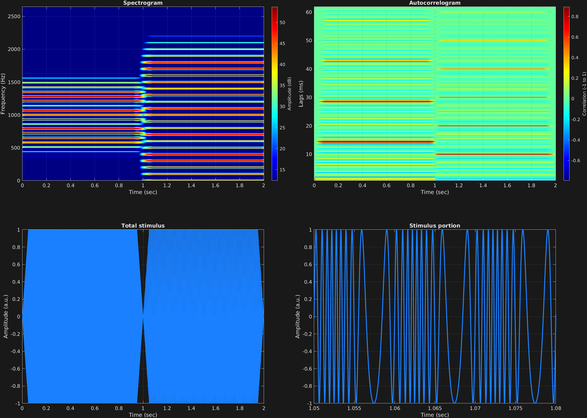

In this frequency modulation example, faster modulation is explored. As with amplitude modulation, when faster frequencies are used for modulation, predictable additions to the spectrum of the signal are observed as a function of the modulation frequencies and depths. Here we have two time spans, each with a different modulation frequency and depth. We remember the frequency modulation equation:

$$x(t)=a_c\sin \big(2\pi f_c t+a_m\sin(2\pi f_m t)+\theta_c\big)$$

In the latter time span, $f_c$ is an integer multiple of $f_m$, giving a harmonic spectrum with fundamental $f_0 =f_m =100$ Hz.

```matlab
% Some plotting parameters
colorRatio=.67;
NFFT=8192*4;
specFreqPerc=[0 12];
specWindowLength=5000;
autoFreqPerc=[1 80];
xTimes=[1.05 1.08];

% Stimulus parameters
tSpans=[0 1;
        1 2];
fs=44100;
carWaves={'sin'};
carFreqs=1000;
carAmps=1;
carThs=0;
rampTime=.05;
rampExp=1;
fmFreq=[70;
        100];
fmAmp=[.35;
       .8];

% Create stimulus structure
s = stimulusMake(1, 'fcn', tSpans, fs, carWaves, carFreqs, carAmps, carThs, ...
    'ramp', rampTime, rampExp, 'fm', {'sin'}, fmFreq, fmAmp);

% Do some visualization
figure(1)
set(gcf,'position',[50 50 1700 1350])

subplot(2,2,1)
[~,~,cbar]=mdlSpec(s.x,NFFT,s.fs,specFreqPerc,specWindowLength);
grid on
temp=get(cbar,'limits');
colormap('jet')
totalRange=diff(temp);
cutoff=(colorRatio*totalRange)+temp(1);
caxis([cutoff temp(2)])

subplot(2,2,2)
mdlAutocorr(s.x,s.fs,autoFreqPerc);
grid on

subplot(2,2,3)
plot(s.t,s.x)
title('Total stimulus')
xlabel('Time (sec)')
ylabel('Amplitude (a.u.)')
grid on
zoom xon

subplot(2,2,4)
plot(s.t,s.x,'linewidth',2)
title('Stimulus portion')
xlabel('Time (sec)')
ylabel('Amplitude (a.u.)')
xlim(xTimes)
grid on
zoom xon
```




