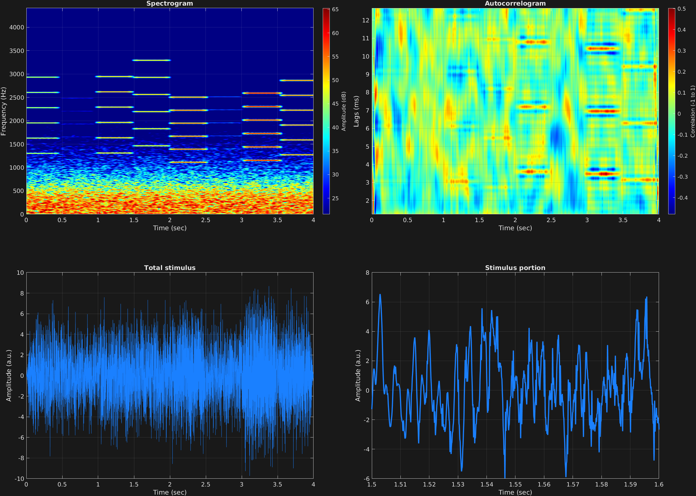

In addition to being able to add a noise mask to individual time spans separately, there is an option to mask all time spans with a common mask. The attribute `'maskall'` works the same way as `'mask'`: A single value is required which is the signal-to-noise ratio in dB. This masking noise can also be filtered. The attribute `'filtmaskall'` works the same way as `'filtmask'`: A single value is required which is a cell array of filter coefficients.

In this example, a common noise mask is used across multiple time spans, and is also filtered. The noise mask is lowpass filtered to be located around the region of multiple missing fundamentals in the signal time spans. In this example, some random numbers are also used, so if you run this code, the results will be different than the visualizations you find here.

The fundamental frequencies of the harmonic stacks are randomized to be in between 200 and 400 Hz, and the amplitudes of the carriers are randomized to be in between 0 and 1, with a common amplitude for each frequency component of a given time span. The larger amplitude time spans stand out in both the spectrogram and autocorrelogram.

```matlab
% Some plotting parameters
colorRatio=.67;
NFFT=8192*4;
specFreqPerc=[0 20];
specWindowLength=5000;
autoFreqPerc=[1 10];
xTimes=[1.5 1.6];

% Stimulus parameters
tSpans=[0 .5;.5 1;1 1.5;1.5 2;2 2.5;2.5 3;3 3.5;3.5 4];
fs=44100;
carWaves={'sin'};
f0s=200+rand(8,1)*200;
harms=[4 5 6 7 8 9];
carFreqs=f0s*harms;
carAmps=rand(8,1);
carThs=0;
rampTime=.05;
rampExp=1;
maskAllDb=-9;
[b,a]=butter(3,400/(fs/2));
maskAllParams={b a};

% Create stimulus structure
s = stimulusMake(1, 'fcn', tSpans, fs, {'sin'}, carFreqs, carAmps, 'ramp', rampTime, rampExp, ...
    'maskall', maskAllDb, 'filtmaskall', maskAllParams);


% Do some visualization
figure(1)
set(gcf,'position',[50 50 1700 1350])

subplot(2,2,1)
[~,~,cbar]=mdlSpec(s.x,NFFT,s.fs,specFreqPerc,specWindowLength);
grid on
temp=get(cbar,'limits');
colormap('jet')
totalRange=diff(temp);
cutoff=(colorRatio*totalRange)+temp(1);
caxis([cutoff temp(2)])

subplot(2,2,2)
mdlAutocorr(s.x,s.fs,autoFreqPerc);
grid on

subplot(2,2,3)
plot(s.t,s.x)
title('Total stimulus')
xlabel('Time (sec)')
ylabel('Amplitude (a.u.)')
grid on
zoom xon

subplot(2,2,4)
plot(s.t,s.x,'linewidth',2)
title('Stimulus portion')
xlabel('Time (sec)')
ylabel('Amplitude (a.u.)')
xlim(xTimes)
grid on
zoom xon
```




[<center>Back to stimulus home</center>](stimuli.html)