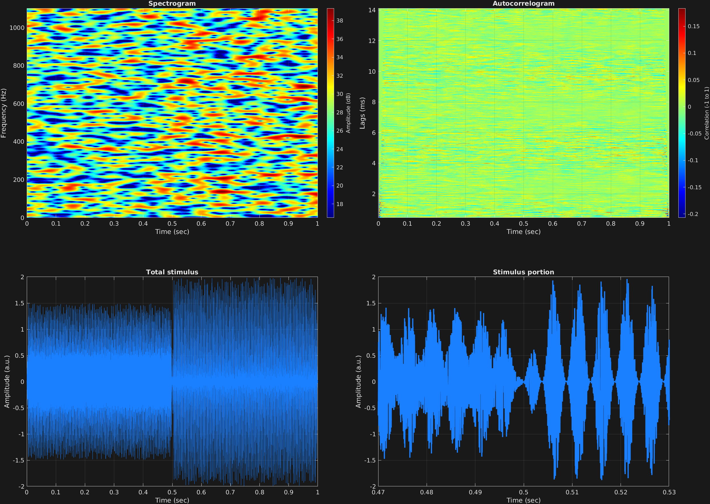

As mentioned previously, another possible carrier waveform is white noise, specified with `'noi'`. An input of carrier frequency is still required, but it does not do anything. One interesting thing that one can do with a noise carrier is modulate its amplitude, as in other examples with a sinusoidal carrier. The same values for the attribute `'am'` are required in this case.

In this example, a noise carrier is amplitude modulated first at a depth 0.5, and then fully with a depth of 1. This creates stimuli which are of interest to pitch perception studies. As can be seen in the visualization, this stimulus does not have any spectral energy at the modulation frequency; indeed its spectrum is effectively flat. It also does not have any periodicity, strictly speaking, evidenced by the autocorrelogram, also without any structure. Yet this type of stimulus has been shown to generate a pitch percept.

```matlab
% Some plotting parameters
colorRatio=.67;
NFFT=8192*4;
specFreqPerc=[0 5];
specWindowLength=5000;
autoFreqPerc=[1 30];
xTimes=[.47 .53];

% Stimulus parameters
tSpans=[0 .5;
        .5 1];
fs=44100;
carWaves={'noi'};
carFreqs=1;
carAmps=1;
carThs=0;
rampTime=.005;
rampExp=1;
amFreq=200;
amAmp=[.5;
        1];
amCfreq=1;

% Create stimulus structure
s = stimulusMake(1, 'fcn', tSpans, fs, carWaves, carFreqs, carAmps, carThs, ...
    'ramp', rampTime, rampExp, 'am', {'sin'}, amFreq, amAmp, amCfreq);

% Do some visualization
figure(1)
set(gcf,'position',[50 50 1700 1350])

subplot(2,2,1)
[~,~,cbar]=mdlSpec(s.x,NFFT,s.fs,specFreqPerc,specWindowLength);
grid on
temp=get(cbar,'limits');
colormap('jet')
totalRange=diff(temp);
cutoff=(colorRatio*totalRange)+temp(1);
caxis([cutoff temp(2)])

subplot(2,2,2)
mdlAutocorr(s.x,s.fs,autoFreqPerc);
grid on

subplot(2,2,3)
plot(s.t,s.x)
title('Total stimulus')
xlabel('Time (sec)')
ylabel('Amplitude (a.u.)')
grid on
zoom xon

subplot(2,2,4)
plot(s.t,s.x,'linewidth',2)
title('Stimulus portion')
xlabel('Time (sec)')
ylabel('Amplitude (a.u.)')
xlim(xTimes)
grid on
zoom xon
```




[<center>Back to stimulus home</center>](stimuli.html)