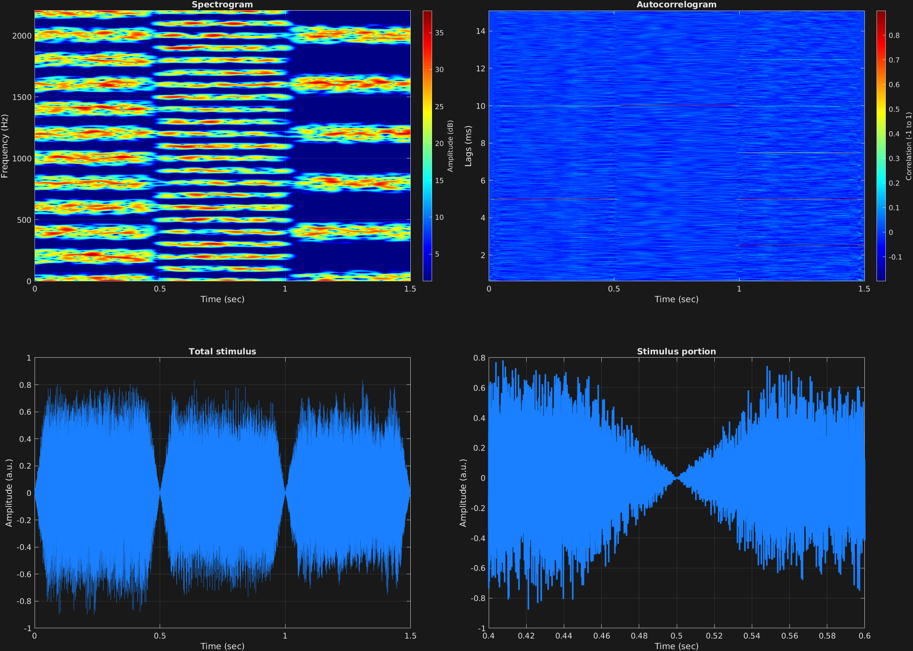

Another attribute-value option is for creating a delay-and-add circuit, often referred to as iterated ripple noise when the carrier is noise. This attribute is called `'iter'` and takes two values: Length of delay in seconds and number of iterations of the delay-and-add process. These can both be scalar, vector, or matrix, depending on the number of time spans and carrier frequencies.

In this example, there are three time spans, with three different delay times. The three time spans also have increasing number of delay-and-add iteration steps.

One notices that the frequency of the pitch perception is correlated with the reciprocal of the delay time, and also that there are sharp peaks in the autocorrelogram at the three delay times in this example: 5 ms, 10 ms, and 2.5 ms. These correspond to the pitch percepts of 200, 100, and 400 Hz, respectively, which are also evident in the spectral peaks. 

```matlab
% Some plotting parameters
colorRatio=.67;
NFFT=8192*4;
specFreqPerc=[0 10];
specWindowLength=5000;
autoFreqPerc=[1 24];
xTimes=[.4 .6];

% Stimulus parameters
tSpans=[0 .5;
        .5 1;
        1 1.5];
fs=44100;
carWaves={'noi'};
carFreqs=1;
carAmps=1;
carThs=0;
rampTime=.05;
rampExp=1;
iterLen=[.005;
         .01;
         .0025];
iterAmount=[4;
            8;
            12];

% Create stimulus structure
s = stimulusMake(1, 'fcn', tSpans, fs, carWaves, carFreqs, carAmps, carThs, ...
    'ramp', rampTime, rampExp, 'iter', iterLen, iterAmount);

% Do some visualization
figure(1)
set(gcf,'position',[50 50 1700 1350])

subplot(2,2,1)
[~,~,cbar]=mdlSpec(s.x,NFFT,s.fs,specFreqPerc,specWindowLength);
grid on
temp=get(cbar,'limits');
colormap('jet')
totalRange=diff(temp);
cutoff=(colorRatio*totalRange)+temp(1);
caxis([cutoff temp(2)])

subplot(2,2,2)
mdlAutocorr(s.x,s.fs,autoFreqPerc);
grid on

subplot(2,2,3)
plot(s.t,s.x)
title('Total stimulus')
xlabel('Time (sec)')
ylabel('Amplitude (a.u.)')
grid on
zoom xon

subplot(2,2,4)
plot(s.t,s.x,'linewidth',2)
title('Stimulus portion')
xlabel('Time (sec)')
ylabel('Amplitude (a.u.)')
xlim(xTimes)
grid on
zoom xon
```




[<center>Back to stimulus home</center>](stimuli.html)
