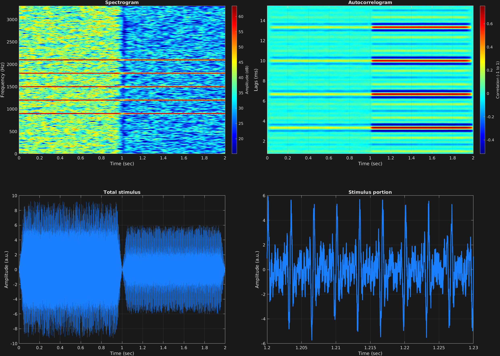

This example demonstrates masking noise. Masking noise can be specified with attribute string `'mask'` and a single value as a scalar or vector (matching time spans) of signal-to-noise ratio(s) in decibels (dB), here denoted as $m$.

For each time span, the root mean square amplitude of the signal $x$ of length $n$, $a_s$, incorporating all frequency components and modulators, is calculated with the well-known RMS equation:

$$a_s=\sqrt{\frac{1}{n}\sum_{i=1}^{n}x_i^2}$$

If the initial amplitude of the white noise $\xi$, $a_{\xi_0}$, is then calculated the same way:

$$a_{\xi_0}=\sqrt{\frac{1}{n}\sum_{i=1}^{n}\xi_i^2}$$

The coefficient on the added noise, $a_\xi$, is then calculated with decibels as:

$$a_\xi=\frac{1}{a_{\xi_0}}10^{\frac{-m}{20}}a_s$$

Here we have two time spans with the same missing-fundamental carrier frequency complexes, one with a -5 dB SNR, and the second with a 5 dB SNR, showing increased signal-to-noise ratio. 

```matlab
% Some plotting parameters
colorRatio=.47;
NFFT=8192*4;
specFreqPerc=[0 15];
specWindowLength=5000;
autoFreqPerc=[1 20];
xTimes=[1.2 1.23];

% Stimulus parameters
tSpans=[0 1;
        1 2];
fs=44100;
carWaves={'sin'};
carFreqs=300*[3 4 5 6 7];
carAmps=1;
carThs=0;
rampTime=.05;
rampExp=1;
maskDB=[-5;
        5];

% Create stimulus structure
s = stimulusMake(1, 'fcn', tSpans, fs, {'sin'}, carFreqs, carAmps, 'ramp', rampTime, rampExp, ...
    'mask', maskDB);


% Do some visualization
figure(1)
set(gcf,'position',[50 50 1700 1350])

subplot(2,2,1)
[~,~,cbar]=mdlSpec(s.x,NFFT,s.fs,specFreqPerc,specWindowLength);
grid on
temp=get(cbar,'limits');
colormap('jet')
totalRange=diff(temp);
cutoff=(colorRatio*totalRange)+temp(1);
caxis([cutoff temp(2)])

subplot(2,2,2)
mdlAutocorr(s.x,s.fs,autoFreqPerc);
grid on

subplot(2,2,3)
plot(s.t,s.x)
title('Total stimulus')
xlabel('Time (sec)')
ylabel('Amplitude (a.u.)')
grid on
zoom xon

subplot(2,2,4)
plot(s.t,s.x,'linewidth',2)
title('Stimulus portion')
xlabel('Time (sec)')
ylabel('Amplitude (a.u.)')
xlim(xTimes)
grid on
zoom xon
```




[<center>Back to stimulus home</center>](stimuli.html)