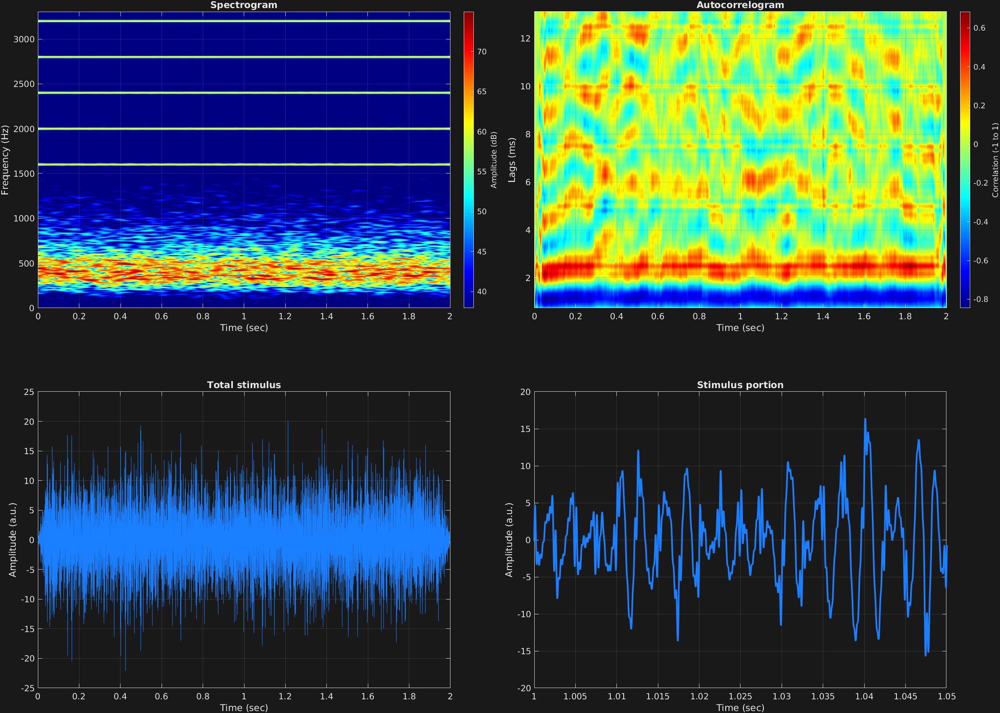

It is also possible to filter masking noise, as is often done in psychophysics. While the [GrFNN Toolbox](https://github.com/musicdynamicslab/grfnntoolbox) does not contain internal filter design, using the attribute `'filtmask'` will simply use MATLAB's `filter()` function to filter the masking noise.

`'filtmask'` takes one value: An Nx2 cell array of filter coefficients, where N is the number of time spans. If only one is specified, it will be copied to all time spans as usual. The first vector is the numerator coefficients of the filter, and the second is the denominator vector.

This example designs a simple bandpass filter with MATLAB's Butterworth filter design tool, and passes the coefficients to `stimulusMake()`. This example contains a missing fundamental stimulus with fundamental frequency 400 Hz, and bandpass masking noise around the missing fundamental. The reciprocal of the missing fundamental, 2.5 milliseconds, is evident in the autocorrelogram.

```matlab
% Some plotting parameters
colorRatio=.67;
NFFT=8192*4;
specFreqPerc=[0 15];
specWindowLength=5000;
autoFreqPerc=[1 17];
xTimes=[1 1.05];

% Stimulus parameters
tSpans=[0 2];
fs=44100;
carWaves={'sin'};
carFreqs=400*[4 5 6 7 8];
carAmps=1;
carThs=0;
rampTime=.05;
rampExp=1;
maskDB=-10;
[b,a]=butter(2,[300 500]/(fs/2));

% Create stimulus structure
s = stimulusMake(1, 'fcn', tSpans, fs, {'sin'}, carFreqs, carAmps, 'ramp', rampTime, rampExp, ...
    'mask', maskDB, 'filtmask', {b,a});


% Do some visualization
figure(1)
set(gcf,'position',[50 50 1700 1350])

subplot(2,2,1)
[~,~,cbar]=mdlSpec(s.x,NFFT,s.fs,specFreqPerc,specWindowLength);
grid on
temp=get(cbar,'limits');
colormap('jet')
totalRange=diff(temp);
cutoff=(colorRatio*totalRange)+temp(1);
caxis([cutoff temp(2)])

subplot(2,2,2)
mdlAutocorr(s.x,s.fs,autoFreqPerc);
grid on

subplot(2,2,3)
plot(s.t,s.x)
title('Total stimulus')
xlabel('Time (sec)')
ylabel('Amplitude (a.u.)')
grid on
zoom xon

subplot(2,2,4)
plot(s.t,s.x,'linewidth',2)
title('Stimulus portion')
xlabel('Time (sec)')
ylabel('Amplitude (a.u.)')
xlim(xTimes)
grid on
zoom xon
```




[<center>Back to stimulus home</center>](stimuli.html)