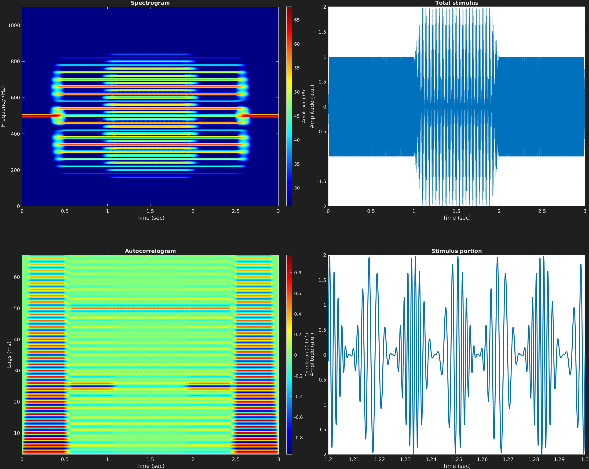

Text can be **bold**, _italic_, or ~~strikethrough~~.

[Link to another page](./another-page.html).

There should be whitespace between paragraphs.

There should be whitespace between paragraphs. We recommend including a README, or a file with information about your project.

# Header 1

This is a normal paragraph following a header. GitHub is a code hosting platform for version control and collaboration. It lets you and others work together on projects from anywhere.

## Header 2

> This is a blockquote following a header.
>
> When something is important enough, you do it even if the odds are not in your favor.

### Header 3

```js
// Javascript code with syntax highlighting.
var fun = function lang(l) {
  dateformat.i18n = require('./lang/' + l)
  return true;
}
```

```matlab
// MATLAB code with syntax highlighting.
%% mdlAutocorr
%  mdlAutocorr(y,fs,varargin)
%
%  Plotting function. Produces an autocorrelogram of signal vector y. Input
%  argument for sampling frequency fs is required. Optional arguments must
%  come in order afterwards, including N and windowStep. N is the desired
%  window length in samples, and windowStep is the desired window step size
%  in samples.

%%
function mdlAutocorr(y,fs,varargin)

if nargin<2,error('mdlAutocorr needs at least 2 inputs: signal vector, and samp. freq.');end
if size(y,1)>1 && size(y,2)>1
    error('Signal must be only a vector');
end

y=y(:);

if isempty(varargin)
    N=ceil(length(y)^(1/1.4));
    windowStep=ceil(length(y)^(1/2.5));
elseif length(varargin)==1
    N=varargin{1};
    windowStep=ceil(length(y)^(1/2.5));
elseif length(varargin)==2
    N=varargin{1};
    windowStep=varargin{2};
else
    error('mdlAutocorr only takes 4 inputs')
end
if ~isreal(y)
    warning('Input signal is complex; ...
        only real portion taken')
    y=real(y);
end

t=(0:length(y))/fs;

% if mod(N,2),N=N+1;end

Tstep = floor((length(y)+N)/windowStep);

x = zeros(1,length(y)+2*N);
x(N:length(y)+N-1) = y;
start = 11;

Sautocorr = zeros(N-start+2,Tstep);

count = 1;
for i = 1:windowStep:length(y)+N
    
    Y = xcorr(x(i:i+N-1),N-1,'coeff');
    Y = Y(N:end);
    Sautocorr(:,count) = Y(start-1:end)';
    
    count = count + 1;
    
end

lags = linspace(start,size(Sautocorr,1)-start+1,size(Sautocorr,1))...
    *1000./fs;

imagesc(t,lags,Sautocorr);colorbar;
title('Autocorrelogram');
xlabel('Time (sec)');ylabel('Lags (ms)');
set(gca,'YDir','normal');
cbar = colorbar;set(get(cbar,'ylabel'),'string','Correlation (-1 to 1)');
```



$$ \sin (2\pi ft) $$

iter.mp3

```ruby
# Ruby code with syntax highlighting
GitHubPages::Dependencies.gems.each do |gem, version|
  s.add_dependency(gem, "= #{version}")
end
```

#### Header 4

*   This is an unordered list following a header.
*   This is an unordered list following a header.
*   This is an unordered list following a header.

##### Header 5

1.  This is an ordered list following a header.
2.  This is an ordered list following a header.
3.  This is an ordered list following a header.

###### Header 6

| head1        | head two          | three |
|:-------------|:------------------|:------|
| ok           | good swedish fish | nice  |
| out of stock | good and plenty   | nice  |
| ok           | good `oreos`      | hmm   |
| ok           | good `zoute` drop | yumm  |

### There's a horizontal rule below this.

* * *

### Here is an unordered list:

*   Item foo
*   Item bar
*   Item baz
*   Item zip

### And an ordered list:

1.  Item one
1.  Item two
1.  Item three
1.  Item four

### And a nested list:

- level 1 item
  - level 2 item
  - level 2 item
    - level 3 item
    - level 3 item
- level 1 item
  - level 2 item
  - level 2 item
  - level 2 item
- level 1 item
  - level 2 item
  - level 2 item
- level 1 item

### Small image


### Large image


### Definition lists can be used with HTML syntax.

<dl>
<dt>Name</dt>
<dd>Godzilla</dd>
<dt>Born</dt>
<dd>1952</dd>
<dt>Birthplace</dt>
<dd>Japan</dd>
<dt>Color</dt>
<dd>Green</dd>
</dl>

```
Long, single-line code blocks should not wrap. They should horizontally scroll if they are too long. This line should be long enough to demonstrate this.
```

```
The final element.
```
