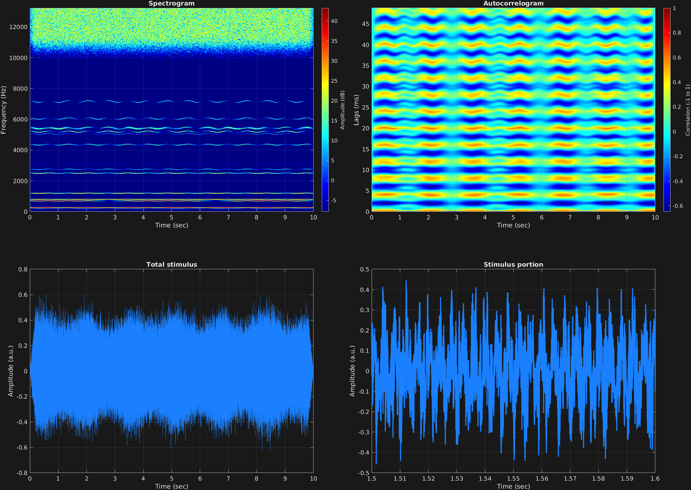

Using several of the attributes that have been described together, combined with some random numbers, we can create interesting soundscapes. In these examples, several carrier frequencies, amplitude modulation, freqeuncy modulation, filtered carriers, and a filtered mask are all utilized. Since these are also randomized to a large extent, the result will not be the same if you run this code yourself. 

```matlab
% Some plotting parameters
colorRatio=.67;
NFFT=8192*4;
specFreqPerc=[0 60];
specWindowLength=3000;
autoFreqPerc=[0 20];
xTimes=[1.5 1.6];

% Stimulus parameters
tSpans=[0 10];
fs=44100;
carWaves={'sin'};
rampTime=.2;
rampExp=1;

numHarm=20;     % number of harmonics in complex
f0=50;         % fundamental freq

factor=4;       % factor by which to bias toward lower harmonics

work = zeros(1,numHarm);
for i = 1:numHarm
    work(i) = randi(floor(fs/f0/2));
    while ~isempty(find(work(1:i-1) == work(i), 1))
        work(i) = randi(floor(fs/f0/2));
    end
    if mod(i,2) && work(i) > factor && isempty(find(work(1:i-1) == floor(work(i)/factor), 1))
        work(i) = floor(work(i)/factor);
    end
end
work = sort(work);
carFreqs = work*f0;

carAmps = zeros(size(carFreqs));
for i = 1:numHarm
    carAmps(i) = rand/work(i);
end

carThs=0;

fmFreq = (rand+1);
fmAmp = rand/100;

amFreq = zeros(size(carFreqs));
for i = 1:numHarm
   amFreq(i) = rand + .2; 
end

amAmp = zeros(size(carFreqs));
for i = 1:numHarm
   amAmp(i) = rand; 
end

amCfreq=1;

[bs,as] = butter(randi([2 5]),rand/2);
aa = rand/2;
bb = rand/4;
[bm,am] = butter(randi([3 6]),[aa aa+bb]);

maskDb=rand*5;

% Create stimulus structure
s = stimulusMake(1, 'fcn', tSpans, fs, {'sin'}, carFreqs, carAmps, 'am', {'sin'},...
    amFreq, amAmp, amCfreq, 'fm', {'cos'}, fmFreq, fmAmp, 'ramp', rampTime, rampExp, ...
    'filtstim', {bs as}, 'mask', maskDb, 'filtmask', {bm am});


% Do some visualization
figure(1)
set(gcf,'position',[50 50 1700 1350])

subplot(2,2,1)
[~,~,cbar]=mdlSpec(s.x,NFFT,s.fs,specFreqPerc,specWindowLength);
grid on
temp=get(cbar,'limits');
colormap('jet')
totalRange=diff(temp);
cutoff=(colorRatio*totalRange)+temp(1);
caxis([cutoff temp(2)])

subplot(2,2,2)
mdlAutocorr(s.x,s.fs,autoFreqPerc);
grid on

subplot(2,2,3)
plot(s.t,s.x)
title('Total stimulus')
xlabel('Time (sec)')
ylabel('Amplitude (a.u.)')
grid on
zoom xon

subplot(2,2,4)
plot(s.t,s.x,'linewidth',2)
title('Stimulus portion')
xlabel('Time (sec)')
ylabel('Amplitude (a.u.)')
xlim(xTimes)
grid on
zoom xon
```




[<center>Back to stimulus home</center>](stimuli.html)